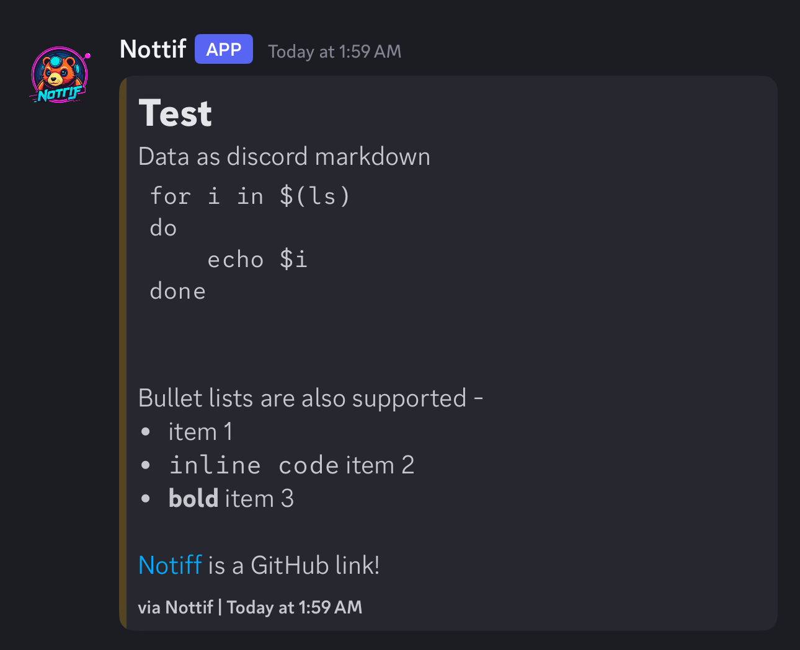

<p align="center">
  
</p>

<p align="center">
  <a href="https://github.com/tanq16/nottif/actions/workflows/release.yml"></a>&nbsp;<a href="https://github.com/tanq16/nottif/releases/latest"></a>
</p><br>

***`Nottif`*** is a command-line tool that sends Discord webhook notifications for given markdown messages.

## Installation

Download the latest release binary for your platform from the [releases page](https://github.com/tanq16/nottif/releases). The tool is available for Linux, macOS, and Windows on both AMD64 and ARM64 architectures.

OR, use `go install github.com/tanq16/nottif@latest` to install with `Go 1.23+`.

## Usage

Nottif can be used in two primary modes: command execution monitoring and raw message sending.

For command execution:

```bash
# Send a message
nottif -m "# Task completed"

# Pipe text to send it
echo "Test\nWebhook" | nottif -w $WEBHOOKURL
```

For persistent webhooks, create a file in any of these locations with a list of webhooks:

- `~/.nottif.webhook`
- `/persist/.nottif.webhook`
- `~/.config/.nottif.webhook`

It will send to all the webhooks. If `-w` is used, it's only sent to that one URL.

> [!TIP]
> Nottif sends the message as text, but Discord interprets it as Markdown. So you can get creative with custom messages! Just be mindful that Discord Markdown has a limited syntax.

## Example

Using the following command:

```bash
printf "# Test\nData as discord markdown \`\`\`bash\nfor i in \$(ls)\ndo\n    echo \$i\ndone\n\`\`\`\n\nBullet lists are also supported -\n- item 1\n- \`inline code\` item 2\n- **bold** item 3\n\n[Notiff](https://github.com/tanq16/nottif) is a GitHub link\!" | nottif
```

gives the following result:


