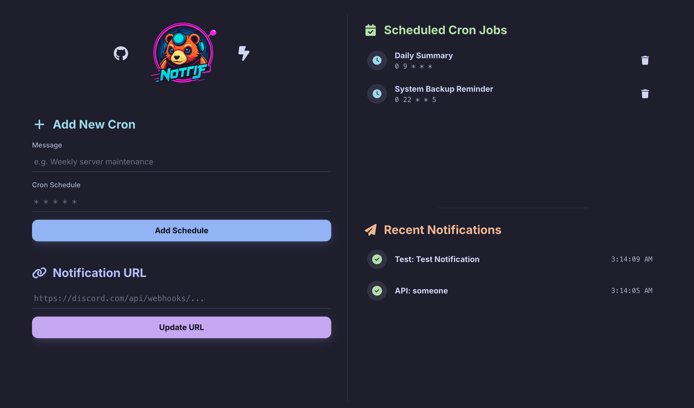

<p align="center">
  
</p>

<p align="center">
  <a href="https://github.com/tanq16/nottif/actions/workflows/release.yml"></a>&nbsp;<a href="https://github.com/tanq16/nottif/releases/latest"></a>
</p>

<p align="center">
Nottif is a self-hosted tool that aggregates notifications to send to Discord webhooks. These notifications can be scheduled in the app or be sent to Nottif via an API from multiple services.
</p><br>

## Features

- **Web Dashboard**: An easy-to-use web interface to manage your settings.
- **Scheduled Notifications**: Add and remove cron jobs directly from the UI to send messages at any schedule.
- **API Endpoint**: A simple JSON API to trigger notifications from your own scripts and applications.
- **Real-time Updates**: The dashboard uses Server-Sent Events (SSE) to display recent notifications instantly without needing a page refresh.

## Screenshot



## Installation

1.  Download the latest release binary for your platform from the [releases page](https://github.com/tanq16/nottif/releases). Builds are provided for Linux, macOS, and Windows on both AMD64 and ARM64 architectures.
2.  Run the binary from your terminal:
    ```bash
    ./nottif
    ```
3.  The server will start on port `8080`. On first run, it will create a `data` directory to store its configuration file (`config.json`).

## Usage

Once the server is running, you can interact with it through the web dashboard or the API.

### Web Dashboard

Navigate to `http://localhost:8080` in your web browser.

From the dashboard, you can:
- **Update the Discord Webhook URL**: Set the destination for all your notifications.
- **Manage Cron Jobs**: Add new scheduled messages or delete existing ones.
- **View Recent Activity**: See a live-updating list of the latest notifications sent by the system.

### API Endpoint

You can send notifications programmatically by making a `POST` request to the `/api/send` endpoint. This is useful for integrating Nottif with CI/CD pipelines, scripts, or other applications.

The endpoint expects a JSON payload with the following fields:

- `content` (required): The message to send. Supports Discord's markdown.
- `username` (optional): The username to display for the notification. Defaults to "Nottif Notification".
- `avatar_url` (optional): The URL of an image to use as the avatar. Defaults to the Nottif logo.

**Example using `curl`:**

```bash
curl -X POST \
  http://localhost:8080/api/send \
  -H "Content-Type: application/json" \
  -d '{
    "content": "**Build Succeeded!**\nVersion: `v1.2.3`\n[View Details](https://example.com)",
    "username": "CI/CD Pipeline"
  }'
```
